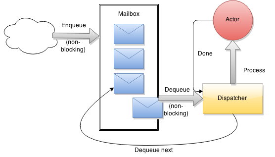

# Actors and messages

The actor concept was born in 1973 thanks to Carl Hewitt.
The actor model provides an abstraction layer over concurrent and distributed processing.

An actor is the most basic unit performing work in Akka.
The API of Akka's actors has borrowed some syntax from Erlang (which has the actor model baked into the language since the 80s).

Its main job is to receive and send messages.

Your systems should contain a lot of actors - think of it as a giant corporation (only *much* faster and more scalable).
Like in a corporation, there is tons of delegating work.

An actor does only one thing at a time.
It has a mailbox, in which messages are enqueued in a non-blocking fashion (so that the caller does not have to wait).

The enqueuing operation wakes up the dispatcher. It then sends the message to the actor, which processes it on the currently assigned thread.
The processing occurs within the actor's `receive` method - it is a *blocking* operation.
The completion of the work wakes up the dispatcher again, which pulls the next message from the queue.



You define what the actor should respond to in the `receive` method.
It's important to know that the type of this method is `PartialFunction[Any, Unit]`, which effectively makes the actor an untyped construct.

```
case class Sun(sunrays: Int)
case class Snow(snowflakes: Int)

class Dog extends Actor {
    def receive = {
       case Sun(sunrays) => {
            if (sunrays > 50) println("Hiding in kennel!")
            else println("Going out to play.")
        }
        
       case Snow(snowflakes) => {
            if (snowflakes > 50) println("Total chaos!!!")
            else println("Sniffing around.")
       }
       
       case 12 => println("I'm a dog, i can't count!")
       case "hello" => println("Woof!")
    }
}
```

The only place where you deal with an actual `Actor` instance is *where you create code for it*.
Everywhere else, you are dealing with `ActorRef`s. It's very important, since `ActorRef`s are the cogs within Akka's machinery - their primary role is to provide support for sending and receiving messages.


The dispatcher serves as an `ExecutionContext`.

Pretty much everything in Akka happens within an `ExecutionContext`.
Using a scheduler also requires an execution context, which assigns the scheduled work to a thread:

```
import scala.concurrent.duration._

println("Be there in a sec.")
context.system.scheduler.scheduleOnce(1 second) {
    println("I'm on some other thread.")
}
```

## The ActorSystem

Every actor you create resides in an `ActorSystem`. It serves as the root of its actor hierarchy.
Apart from that, it provides facilities and functions for actors residing within it:
- System configuration
- The default `Scheduler` and `Dispatcher` (along with an `ExecutionContext`)
- A generally accessible `EventStream`, to which you can publish and subscribe messages
- A `deadLetters` actor (more on this in the `routing` and `supervision` branches)
- An `actorSelection(actorPath: String|ActorPath)` method, with which references to actors running within the system can be obtained.
- Functions for shutting down the system as well as its resident actors.

## So how do you actually start with this?

It's pretty simple:
```
import akka.actor.{ActorSystem, Props, ActorRef}

case class Message(value: String)

class PingActor(pong: ActorRef) extends Actor {
    pong ! Message("Ping!")

    def receive = {
        case Message(v) => sender() ! Message(v + " Ping!")
    }
}

class PongActor extends Actor {
    def receive = {
        case Message(v) => sender() ! Message(v + " Pong!")
    }
}

object Foo extends App {
 implicit val system = ActorSystem("FooSystem")
 val pong = system.actorOf(Props[Pong], name = "pong")
 val ping = system.actorOf(Props(classOf[Ping], pong), name = "ping")
}
```

## Communication patterns

You've seen `!` already - it's called `tell`.

There is a different pattern, called `ask` or `?`, that behaves a bit differently (and should be used with more caution).
If we were to use this pattern in our ping pong example:

```
import akka.pattern.{ask, pipe};
import scala.concurrent.duration._;

case object GimmeData
case class Data(value: Int)

class DataGenerator extends Actor {
    def generateData() = 42

    def receive = {
        case GimmeData => {
            val originalSender = sender() // Remember the scheduler example?
            context.system.scheduler.scheduleOnce(1 second) {
                // Everything in this closure happens on another thread.
                // DO NOT close over actor state here!!!!
                originalSender ! Data(generateData ())
            }
        }
    }
}

class DataProxy(dataGenerator: ActorRef) extends Actor {
    implicit val timeout = Timeout(5 seconds)
    def receive = {
        case GimmeData => {
            (dataGenerator ? GimmeData)
                .mapTo[Data]
                .pipeTo(sender())
            // You could also do
            // dataGenerator forward GimmeData

        }
    }
}
```

The `pipeTo` pattern covers up responding to the sender in a thread-safe way.
If possible, always use `pipeTo` when dealing with futures inside actors.
If that's not possible for whatever reason, use the `originalSender` trick.

While `ask` is useful for some purposes (e.g. queries from the REST API level), it's generally considered a good practice to avoid having too much of it in your application.

This is mainly due to the fact that failures happening 'underneath' an `ask` get covered with an `AskTimeoutException` instead of being escalated directly.
Also, each `ask` spawns an anonymous actor underneath to handle the execution, which is a bit more bloated than just using a `!`.

# The exercise

We are going to implement a restaurant system, inspired by https://lostechies.com/jimmybogard/2013/03/11/saga-implementation-patterns-observer/ (I'd like to thank @arturopala for the idea).
The structure will be similar to this:


There are "TODO [WORKSHOP]" comments in places where there is something that needs to be filled out.

You're done when the following is true:
- All the tests are green (`sbt test`).
- When you run the app (`sbt run`), you can post a JSON like `{ "sandwiches": 1, "fries": 1, "salads": 1, "coffees": 1, "shakes": 1, "drinks": 1 }` to http://localhost:8080/orders and get a response containing an order. (this info is available when you open localhost:8080 in the browser)

**If you have any questions or are facing any difficulties, please speak up as I understand that this material might be confusing at first glance.**